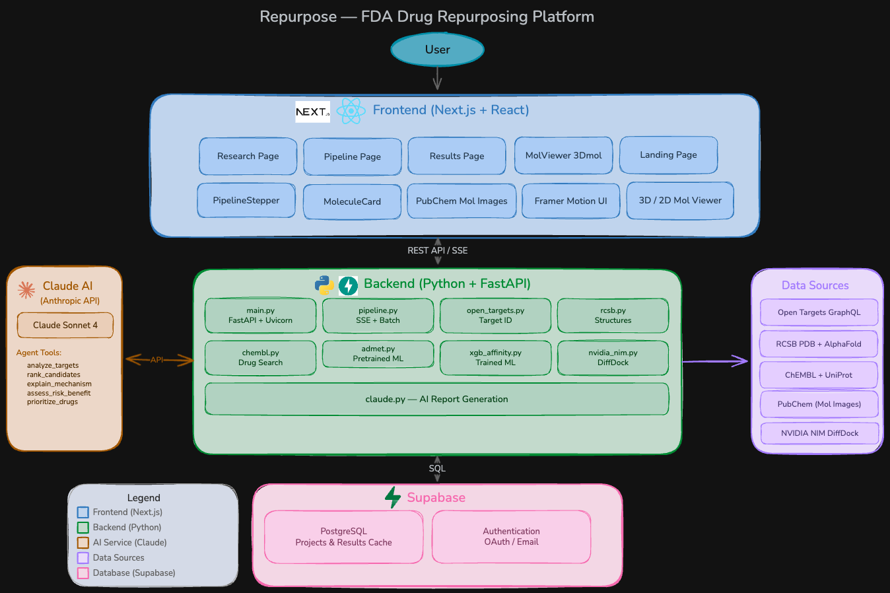

# Repurpose

**Team Buck** — Nimai Bhat, Samay Patel, Praketh Potlapalli, Harsha Kalivarapu

Metformin, a diabetes drug, was found to have a use case for pancreatic cancer after 50 years. Thalidomide, originally a sedative, took decades before it was repurposed for multiple myeloma. These discoveries happened largely by accident. The process of finding new uses for existing drugs is slow, fragmented, and buried across disconnected databases and tools that most researchers don't have time to piece together.

Repurpose is an AI-powered drug repurposing platform that changes this. Given a disease name, it automatically finds protein targets, retrieves 3D structures, searches for approved drugs, runs molecular docking simulations, predicts binding affinity and safety profiles, and generates AI-powered analysis reports, all streamed to the UI in real time.

## How It Works

The platform runs a 7-step automated pipeline:

1. **Target Identification**: Queries the Open Targets GraphQL API to find the top disease-associated protein targets ranked by association score
2. **Structure Retrieval**: Fetches 3D protein structures from RCSB PDB (with AlphaFold fallback for predicted structures)
3. **Drug Search**: Queries ChEMBL for approved and clinical-phase compounds targeting each protein, extracting SMILES, mechanisms of action, and clinical phase data
4. **Molecular Docking**: Runs NVIDIA DiffDock simulations for each protein-drug pair, producing confidence scores and 3D ligand poses
5. **Binding Affinity**: Predicts pKd from SMILES using an XGBoost model trained on PDBbind v2020 (14 RDKit descriptors + 6 ADMET sub-scores)
6. **ADMET Safety**: Scores absorption, distribution, metabolism, excretion, toxicity, and drug-likeness using RDKit descriptors and an optional Tox21 deep learning model
7. **AI Report**: Claude generates mechanistic explanations, risk/benefit assessments, and a prioritized candidate ranking

Candidates are ranked by a combined score: binding confidence (40%) + affinity (15%) + safety (45%). A novelty check flags whether each candidate is novel, in trials, or already approved for the disease.

Results stream to the frontend via Server-Sent Events (SSE), so each step renders as it completes.

## Architecture



## Tech Stack

| Layer | Technology |
|-------|-----------|
| Frontend | Next.js 15, React 19, TypeScript, TailwindCSS, Framer Motion |
| 3D Visualization | 3Dmol.js (protein structures + docked ligands) |
| Backend | FastAPI, Uvicorn, Pydantic |
| Docking Engine | NVIDIA NIM DiffDock |
| Binding Affinity | XGBoost (trained on PDBbind v2020) |
| Safety Profiling | RDKit descriptors, DeepChem Tox21 |
| AI Analysis | Claude (Anthropic API) |
| Data Sources | Open Targets, RCSB PDB, AlphaFold, ChEMBL, UniProt |
| Database | Supabase |

## Project Structure

```
repurpose/
├── src/
│   ├── app/
│   │   ├── page.tsx                # Landing page
│   │   ├── research/page.tsx       # Disease input & search config
│   │   ├── pipeline/page.tsx       # Real-time pipeline visualization
│   │   ├── pipeline/protein/       # Target-first pipeline variant
│   │   └── results/page.tsx        # Results with rankings, 3D viewer, AI report
│   └── components/
│       ├── DashboardViewer.tsx      # 3D protein + ligand viewer (3Dmol.js)
│       ├── MolViewer.tsx            # 2D molecule rendering
│       ├── MoleculeCard.tsx         # Drug candidate card
│       ├── ADMETRadar.tsx           # ADMET radar chart
│       ├── ConfidenceHeatmap.tsx    # Binding confidence heatmap
│       └── PipelineStepper.tsx      # Pipeline progress indicator
├── backend/
│   ├── main.py                     # FastAPI app, model loading at startup
│   ├── config.py                   # Environment/settings
│   ├── routes/
│   │   ├── pipeline.py             # Disease → drug pipeline (batch + SSE)
│   │   ├── pipeline_protein.py     # Target-first pipeline variant
│   │   ├── targets.py              # Target search endpoint
│   │   ├── structures.py           # PDB structure retrieval
│   │   ├── drugs.py                # Drug/compound search
│   │   ├── docking.py              # DiffDock docking endpoint
│   │   ├── admet.py                # ADMET prediction endpoint
│   │   └── report.py               # AI report generation
│   ├── services/
│   │   ├── open_targets.py         # Disease → protein targets
│   │   ├── rcsb.py                 # PDB structures + AlphaFold fallback
│   │   ├── chembl.py               # Drug/compound search via ChEMBL
│   │   ├── nvidia_nim.py           # DiffDock batch docking
│   │   ├── xgb_affinity.py         # XGBoost binding affinity prediction
│   │   ├── admet.py                # ADMET safety scoring (RDKit + Tox21)
│   │   ├── novelty.py              # Drug novelty check via Claude
│   │   ├── claude.py               # AI report generation
│   │   └── registry.py             # Supabase database helpers
│   ├── models/
│   │   ├── xgb_affinity/           # Trained XGBoost model + metadata
│   │   └── tox21/                  # Pre-trained Tox21 toxicity model
│   └── scripts/
│       ├── train_xgb_affinity.py   # Train affinity model on PDBbind v2020
│       └── train_tox21.py          # Train Tox21 toxicity model
```

## Setup

### Prerequisites

- Node.js 18+
- Python 3.11+
- API keys for: NVIDIA NIM, Anthropic (Claude), Supabase

### Environment Variables

Create a `.env` file in the project root:

```env
NEXT_PUBLIC_SUPABASE_URL=<your-supabase-url>
NEXT_PUBLIC_SUPABASE_PUBLISHABLE_DEFAULT_KEY=<your-supabase-key>
NVIDIA_NIM_API_KEY=<your-nvidia-nim-key>
ANTHROPIC_API_KEY=<your-anthropic-key>
```

### Frontend

```bash
npm install
npm run dev        # http://localhost:3000
```

### Backend

```bash
cd backend
pip install -r requirements.txt
uvicorn main:app --reload --port 8000
```

API docs available at http://localhost:8000/docs.

### Training the Affinity Model (Optional)

The repo includes a pre-trained XGBoost model. To retrain on PDBbind v2020:

```bash
cd backend
python3 scripts/train_xgb_affinity.py --pdbbind-dir /path/to/refined-set
```

## Usage

1. Open http://localhost:3000 and click through to the research page
2. Enter a disease (e.g. "pancreatic cancer")
3. Choose a mode — **Explore** (all targets), **Target** (specific protein), or **Drug** (specific compound)
4. Click **Run Analysis** — the pipeline page streams progress in real time
5. View the full results page with ranked candidates, 3D docked poses, ADMET profiles, and AI-generated recommendations
